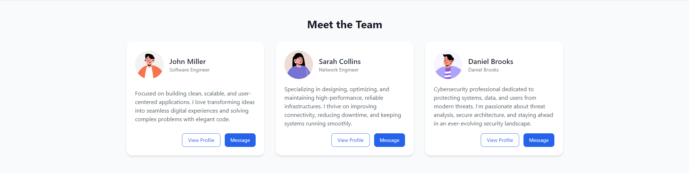

# User Cards - Web Components


A simple, reusable custom web component for displaying user information with a skeleton loading state using Tailwind CSS.

## Table of contents

- [Preview](#preview)
- [Features](#features)
- [Usage](#usage)
  - [Example](#example)
- [Attributes](#attributes)
- [MIT License](#license)

## Preview



## Features

- Native Web Component (`<user-card>`) — no frameworks required
- Built-in skeleton loader while avatar or content is loading
- Fully Tailwind CSS-based
- Handles avatar loading and fallback
- Supports custom labels, roles, bios, and buttons
- Optional simple male/female avatars

## Usage

Add a `<user-card>` element with optional attributes:

```html
<user-card
    label       =   "John Doe"
    role        =   "Software Engineer"
    avatar      =   "https://avatar.iran.liara.run/public/12"
    bio         =   "Focused on building clean, scalable, and user-centered applications."
    btn1-label  =   "View Profile"
    btn2-label  =   "Message">
</user-card>
```

### Example


## Attributes

| Attribute  | Description                 | Default / Example                       |
|------------|-----------------------------|-----------------------------------------|
| `label`      | User name                   | User Card                               |
| `role`       | User role                   | No information given                    |
| `avatar`     | Avatar image URL            | https://avatar.iran.liara.run/public/35 |
| `bio`        | Short biography             | Lorem ipsum                             |
| `btn1-label` | Label for the first button  | View Profile                            |
| `btn2-label` | Label for the second button | Message                                 |

---

## License

MIT License — free to use and modify.
